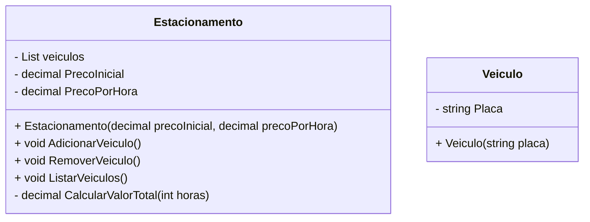

# Sistema de Estacionamento 

> Projeto de exemplo com C# e .NET para gerenciar veículos estacionados via console.

## Origem do projeto

Este repositório contém uma solução para o desafio proposto na trilha de .NET (Fundamentos) da plataforma Digital Innovation One (DIO), como é possível vizualizar pelo fork.  
A proposta original do desafio pode ser consultada em:

https://github.com/digitalinnovationone/trilha-net-fundamentos-desafio/blob/main/README.md

## Visão geral

Aplicação console simples em C# que permite:

- Adicionar veículos ao estacionamento pela placa.
- Remover veículos informando a placa e a quantidade de horas estacionadas (cálculo de cobrança).
- Listar veículos atualmente estacionados.

O objetivo é demonstrar modelagem básica (modelos `Veiculo`, `Estacionamento`), validação simples e interação via entrada/saída no console.

## Estrutura do projeto

- `Estacionamento/Models/Veiculo.cs` — modelo simples que contém uma **Placa** sempre em maiúsculas.
- `Estacionamento/Models/Estacionamento.cs` — lógica principal: gerencia a lista de veículos, adiciona, remove e lista; também calcula o valor a pagar ao remover um veículo.
- `Estacionamento/Program.cs` — ponto de entrada (console) que interage com o usuário.

## Diagrama de classes (Mermaid)

Abaixo está o diagrama de classes simplificado em Mermaid que representa as principais entidades do projeto.



## Funcionalidades e comportamento

- **Adicionar veículo**: solicita a placa (única para cada veículo), instancia um `Veiculo` e adiciona à lista interna.
- **Remover veículo**: solicita a placa, verifica se o veículo existe; se existir, solicita as horas estacionadas, calcula o valor total com base no preço inicial e preço por hora, remove o veículo e exibe o total.
- **Listar veículos**: exibe todas as placas dos veículos atualmente estacionados; se não houver veículos, informa que o estacionamento está vazio.

**Observações de implementação:**

- Não há persistência: os dados ficam apenas em memória enquanto a aplicação roda.
- A interface é via console; não há verificação avançada de formato da placa além do comprimento.

## Requisitos

- **.NET SDK 8.0** (migrado do .NET 6.0 original para aproveitar recursos modernos como **Construtores Primários** e **Raw String Literals**).  
- A versão usada pode ser modificada no arquivo "DesafioFundamentos.csproj" (opcional).

## Como executar 

Abra um terminal na raiz do repositório e rode:

### Windows (PowerShell ou CMD)
```
dotnet run --project .\DesafioFundamentos\DesafioFundamentos.csproj
```
### Linux / macOS (Bash ou Zsh)
```
dotnet run --project ./DesafioFundamentos/DesafioFundamentos.csproj
```

Em seguida, siga as instruções no console para adicionar, listar ou remover veículos.

## Exemplos de uso

- **Adicionar**: digite a placa quando solicitado (ex: `ABC-1234`).
- **Remover**: informe a placa e depois a quantidade de horas (inteiro).  
  O valor exibido será: **preço inicial + preço por hora × horas**.

## Executando os Testes Automatizados

O projeto inclui uma suíte de testes unitários usando o framework **xUnit** para garantir que a lógica de negócio da classe `Estacionamento` funcione como esperado. Os testes validam os cenários de adicionar, remover e listar veículos.

Para executar os testes, abra um terminal na raiz do repositório e utilize o seguinte comando:

```bash
dotnet test
```

## Decisões de Implementação

As seguintes escolhas de design foram feitas durante a implementação.  
Cada uma é referenciada no código como `DEC-XX`.

### DEC-01 — Validação de placa diretamente no modelo
A validação simples foi feita no construtor da classe `Veiculo` (verificação de `null/empty` e tamanho de 8 caracteres).  
Uma interface `IValidadorPlaca` foi considerada já que permitiria que os veículos "assinassem" diferentes tipos de placas com diferentes validações e formatos, mas seria **over-engineering** para este desafio.  
Optei por manter a validação mínima diretamente no modelo.

### DEC-02 — Construtor Primário no Estacionamento
Utilizei **Construtores Primários** do C# 12 / .NET 8 para evitar boilerplate de propriedades readonly.  
Esse recurso não existia na versão original do desafio (.NET 6).  
A migração para .NET 8 foi uma escolha consciente para aproveitar a sintaxe moderna. 

Esse Construtor Primário cria para minha classe os atributos como readonly, acessáveis para uso na classe, o que é vantajoso nesse caso visto que eu não estou permitindo que esses atributos sejam modificados, mas se assim eu quisesse, eu não usaria o Construtor Primário.

### DEC-03 — Separação parcial de responsabilidades
Idealmente, a classe `Estacionamento` não deveria conter `Console.WriteLine/ReadLine`, mas apenas a lógica de negócio.  
Para simplificação do desafio (foco didático), mantive a interação com o usuário dentro da classe.  
Essa decisão facilita a leitura por iniciantes, mesmo sacrificando a separação estrita de responsabilidades.

### DEC-04 — Cálculo do valor extraído para método separado
Foi criado o método privado `CalcularValorTotal(int horas)` dentro de `Estacionamento`, responsável por calcular a cobrança.  
Isso melhora a coesão, facilita manutenção e possibilita testes unitários isolados do cálculo.

### DEC-05 — Uso de `RemoveAll` para exclusão por placa
Para remover veículos, usei o .RemoveAll() mesmo sabendo que só existe um, assim não é preciso procurar a placa com .FirstOrDefault(), instanciar um novo Veiculo e depois fazer o .Remove() comparando com essa nova instancia.

Essa abordagem é mais concisa e evita criação de objetos intermediários.

### DEC-06 — Tratamento de input inválido
Nos inputs de valores numéricos (`decimal` no preço e `int` nas horas), optei por `TryParse` quando a validação era importante (horas)  
e por `Convert.ToDecimal` no preço inicial/hora (para manter a simplicidade).  
Uma melhoria futura seria aplicar `TryParse` também nos preços.

Uso de TryParse() na conversão de horas ao inves de Convert() para não gerar uma exceção no caso onde o usuário apenas digita ENTER sem digitar nada.

### DEC-07 — Uso de Raw String Literals para menus
Aproveitei o recurso de **Raw String Literals** (`""" ... """`) introduzido no C# 11 / .NET 7.  
Isso permite escrever menus multiline de forma mais limpa e legível.  
Essa decisão reforça a migração para .NET 8, já que o projeto original em .NET 6 não suportaria esse recurso.

### DEC-08 — Versão do .NET
O projeto foi migrado de **.NET 6.0 (original do desafio)** para **.NET 8.0**, garantindo suporte a:
- Construtores Primários (C# 12);
- Raw String Literals (C# 11+);
- Melhorias gerais de performance e manutenção de longo prazo (LTS).

### DEC-09 — Comportamento seguro de Clear / ReadKey com I/O redirecionado
No `Program.cs` foi implementado um comportamento que evita chamar `Console.Clear()` e `Console.ReadKey()` quando a aplicação está sendo executada em um ambiente com I/O redirecionado (por exemplo, durante debug com entrada/saída redirecionadas, execução em pipeline/CI ou testes automatizados). 

ReadKey() foi escolhido para uma resposta mais imediata, ele é mais comum de ser usado nesse tipo de situação de interromper a execução do programa ou em casos que você quer capturar exatamente qualquer tecla. 

## Possíveis melhorias

- Validar formato de placa de forma mais robusta, ou usar uma interface para validação de diferentes padrões (ex.: Mercosul).
- Persistir os dados (arquivo JSON, banco de dados leve, etc.).
- Admitir gerenciamento de vagas e horários de entrada/saída com registro datado.